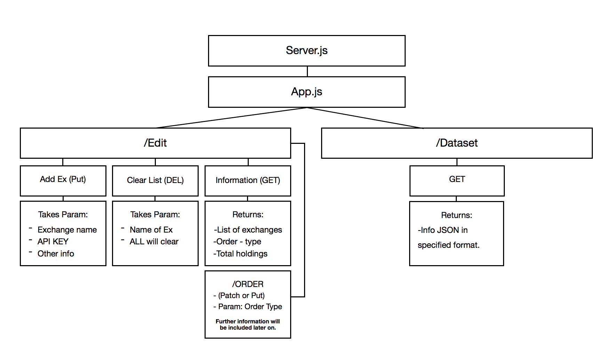

# Digital Asset Central Portfolio
An API for cryptoasset investors to access transaction history

In the cryptosphere, there are many investors that spend their time on cryptoasset exchanges. Each
exchange has a transaction ledger which holds a users history. Since many investors use multiple
exchanges (because they all differ in many ways), it is difficult to keep up with all of your
trades and true portfolio growth.

DACP serves as a way for investors and traders to access all transaction history from their
cryptoasset exchanges on one central ledger. The transaction dataset will be accessible through an
REST API built using Javascript and NODE.js.

DACP will use [CCXT](https://github.com/ccxt/ccxt), a library that accesses all API's from
cryptoasset exchanges, to pull all the information from the particular exchanges.

## How it Works

* API access

There are certain security protocols that exchanges use to privatize user personal information on
exchanges. In order to go through security through the API, a user needs to ask for an API key in
order to be authorized to access the personal information.

DACP uses a API_KEYS.txt file which contains a JSON to hold all of the information needed to gain
access to the users accounts. It is the one input that the library needs to set up the transaction
dataset. The file can be created in two ways. It can either be written by the user by following the
proper format, and included in the DACP directory, or, by using the available commands in the edit
route, the library can build the file.

This file is included in the .gitignore to ensure that contributors do not share their personal
information while contributing.

* Process of Building the Dataset

The JSON dataset containing all transactions is created at the launch, but empty. Once exchanges
are added to the API_KEYS file, DACP then begins to work with CCXT to contact the given exchange.
Once the information is received, the transactions will be added to the JSON file in chronological
order under the particular exchange. The transactions of exchanges can be added or deleted manually
through the API_KEYS.txt or automatically through the ./edit route.

## Layout of API Routes

The following is the layout of the API routes

**Route Details:**

* Edit (./edit)
In the edit route, the user is capable of editing the dataset in multiple ways. The following is the
breakdown of how the dataset can be edited:

 - Get (GET request)
 This request returns the status of the dataset. Some of the details will include the list of
 exchanges, list of assets, order type, total holdings, etc.

 Param: None
 Return: JSON of the status of the dataset.

 - Add (PUT request)
 This request allows for the user to add an exchange they belong to onto the dataset. The user is
 prompted to input the proper validation information so that the software can access the users
 personal information within the exchange API. Adding an exchange to the dataset will automatically
 update the API_KEYS document for future use.

 Param: (exchange ID, API KEY)
 Return: Confirmation message

 - Delete (DELETE request)
 This request allows for the user to delete an exchange from the dataset. If the user would like to
 clear all data, they may input "all" as a parameter. Deleting an exchange to the dataset will
 automatically update the API_KEYS document.

 Param: (exchange ID or "all")
 Return: Confirmation Message

* Access(./access)

 - Get (GET request)
 This request returns the dataset in the set order and with the appropriate exchanges that
 specified by the user.

 Param: None
 Return: Dataset of information

**Options to Order Data**

The user has the option to order the transactions by the exchange it was made on, the type of asset
that is being traded, or by the transactions themselves. The default order in which the transaction
data is formatted in is by alphabetical order of the exchange it belongs to. The following is the
breakdown of ordering options:

* by Exchange (default)  
Exchanges can either be ordered by alphabetical order or size of the holding(in USD)

* by Asset  
Assets are can be ordered by either alphabetical order or size of the holding(in USD)

* by Transactions  
Transactions can be ordered by either chronological order or by size(in USD)

## License

This repository is licensed under the MIT License. Details can found in the [license file](https://github.com/Pyeskyhigh/DACP/blob/master/LICENSE).

## Contributors & Followers

Help is greatly appreciated as long as people follow the [Contributing]() rules and the [Code of
Conduct](https://github.com/Pyeskyhigh/DACP/blob/master/CODE_OF_CONDUCT.md).
